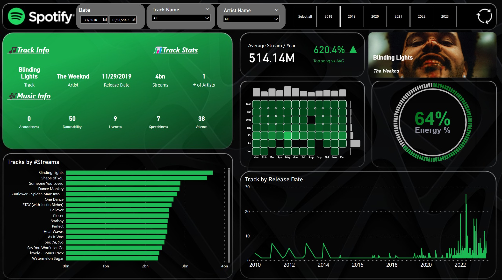

# 🎵 Spotify Music Streaming & Audio Intelligence Dashboard

[](https://powerbi.microsoft.com/)
[](https://www.python.org/)
[](https://developer.spotify.com/)

A music streaming intelligence dashboard built in **Power BI** coupled with an automated **Python Spotify Web API data enrichment script**. The dashboard provides deep analytical exploration into global streaming milestones, artist performance, audio feature signatures, and cross-platform presence.

---

## 📸 Dashboard Interface



---

## 🎯 What This Project Covers

- **Streaming Volume & Reach**: Track total stream milestones across top global tracks and artists.
- **Audio Attributes & Mood Profiling**: Analyze how sonic dimensions (Danceability, Energy, Valence, BPM, Acousticness, Speechiness) correlate with streaming popularity.
- **Cross-Platform Syndication**: Evaluate multi-platform playlist inclusion and charting behavior across **Spotify**, **Apple Music**, **Deezer**, and **Shazam**.
- **Automated Artwork Enrichment**: Dynamic API pipeline (`SpotifyScript.py`) that queries the Spotify Web API to pull track identifiers and album cover art URLs directly into the dataset.

---

## 📊 Core Visualizations & Analytics

### 1. Artist & Song Rankings
- Top streamed tracks by total play counts.
- Artist presence distribution and solo vs. collaborative performance comparisons.

### 2. Audio Feature Distribution
- **BPM & Tempo Distribution**: Clustering of top hits in popular tempo zones.
- **Valence vs. Energy**: Mapping positive emotional tone against musical intensity.
- **Acoustic vs. Danceability**: Identifying electronic production trends vs. organic acoustics.

### 3. Cross-Platform Chart & Playlist Presence
- Comparative counts of songs in Spotify, Apple Music, and Deezer curated playlists.
- Shazam chart ranks evaluating discovery velocity.

---

## 🔄 Python Spotify Web API Enrichment

The repository includes `SpotifyScript.py` to augment raw song records with official Spotify album art and track metadata:

```
[Raw Song Dataset] ──► [Spotify OAuth 2.0] ──► [/v1/search & /v1/tracks] ──► [Enriched Dataset with Album Art] ──► [Power BI UI]
```

### Key Script Features
- **Client Credentials Flow**: Secure authentication using Spotify Developer app tokens.
- **Resilient API Calls**: Automatic rate-limit handling with exponential backoff.
- **Flexible Path Discovery**: Auto-detects input datasets without hardcoded absolute paths.

---

## 📐 Key DAX Measures

```dax
// Total Streams
Total Streams = SUM('SpotifyData'[streams])

// Total Track Count
Track Count = COUNTROWS('SpotifyData')

// Average Danceability Percentage
Avg Danceability = AVERAGE('SpotifyData'[danceability_%]) / 100

// Average Valence (Mood Positivity)
Avg Valence = AVERAGE('SpotifyData'[valence_%]) / 100

// Total Multi-Platform Playlist Inclusions
Total Playlists = 
    SUM('SpotifyData'[in_spotify_playlists]) + 
    SUM('SpotifyData'[in_apple_playlists]) + 
    SUM('SpotifyData'[in_deezer_playlists])
```

---

## 📂 Repository Layout

```
spotify_dashboard/
├── .env.example               # Template for Spotify API environment variables
├── .gitignore                 # Excluded files and temporary data
├── requirements.txt           # Python package requirements
├── README.md                  # Project overview and usage guide
├── Spotify.jpg                # Dashboard preview screenshot
├── Spotify.pbix               # Complete interactive Power BI report
└── SpotifyScript.py           # Python data enrichment pipeline
```

---

## ⚡ How to Use

### 1. View Dashboard in Power BI
1. Open [`Spotify.pbix`](Spotify.pbix) in **Power BI Desktop**.
2. Explore interactive slicers, drill-downs, and audio feature distributions.

### 2. Run Data Enrichment (Optional)
```bash
# Install dependencies
pip install -r requirements.txt

# Configure credentials in .env (or pass via CLI)
# SPOTIFY_CLIENT_ID=your_id
# SPOTIFY_CLIENT_SECRET=your_secret

# Run script
python SpotifyScript.py --output spotify_enriched_data.csv
```

---

## 🛠️ Tools & Technologies

- **Power BI Desktop** (Data Modeling, DAX, Custom Dark Theme Visuals)
- **Python 3** (Requests, Pandas, Dotenv, Tqdm)
- **Spotify Web API** (Track Catalog & Album Artwork Retrieval)
